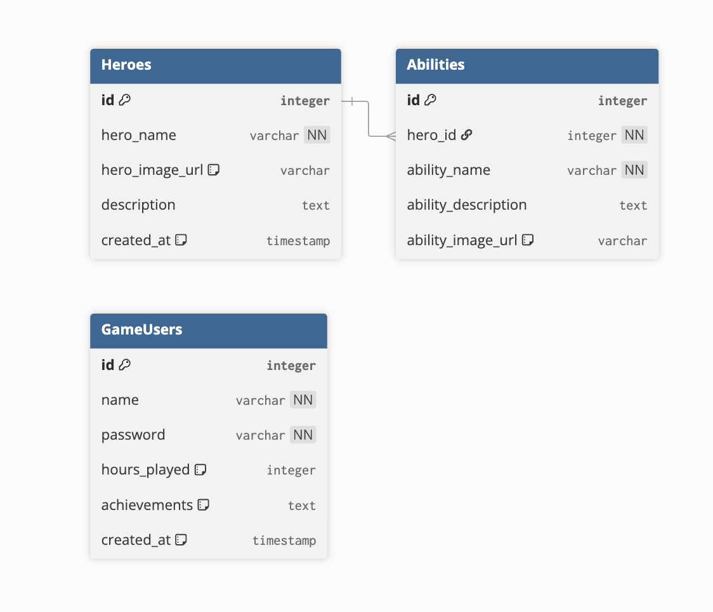
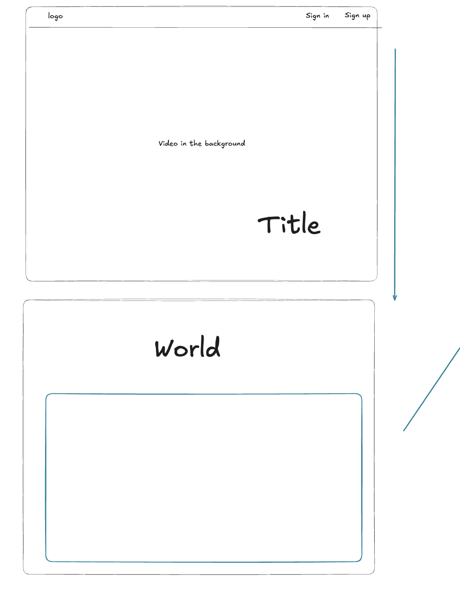
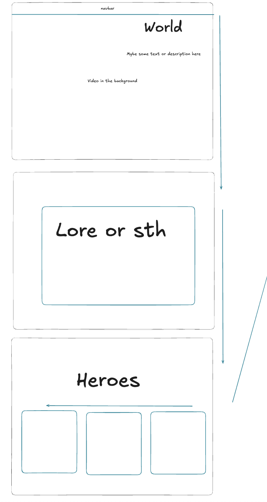
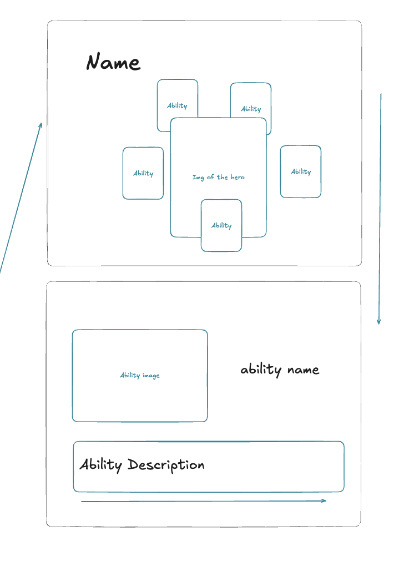

# The Age of Renunciation

## Project Overview

This repository hosts the front-end and back-end source code for a dedicated fan showcase website for a fictional Dark Fantasy RPG: **The Age of Renunciation**.

The primary goal of this project is to create an immersive webpage that exhibits the rich world building, high contrast visual style, unique gameplay concepts, and compelling character designs of the game, treating it as if it were a real, published title.

---

## Core Features (Initial Release)

The initial version focuses on establishing the core infrastructure and character data viewing capabilities:

1.  **Character Codex:** Display a gallery of the main Heroes along with their biographies, and descriptions of their unique abilities (Runic Stomp, Crimson Bulwark, etc.).
2.  **World Showcase:** Present AI-generated images and cinematic video content (like the "Crystal Forest Battle" continuation) to showcase the game's atmosphere and environment.
3.  **Basic User Profile:** Authenticated users can access a personal profile page to view their initial, raw game statistics, including:
    * `hours_played`
    * `achievements` (displayed as a simple data field initially).

---

## Technology Stack

| Component | Technology | Description |
| :--- | :--- | :--- |
| **Backend/API** | **Django (Python)** | Used for routing, data validation, API endpoint creation, and business logic. |
| **Database** | **PostgreSQL** | Provides reliable, relational data persistence for the complex Hero and Ability structures. |
| **Frontend** | **React / Vite (JavaScript)** | Delivers a fast, component based, and modern user interface. |
| **Styling** | Custom CSS | Focuses on a dark, high-contrast aesthetic matching the game's art style. |
| **Assets** | **AI-Generated Imagery** | All visual assets (characters, abilities, cinematic sequences) were created using AI tools to achieve the unique visual fidelity. |

---

## Database Schema Overview (DBML)

The data structure is built around a relational model to manage the complex relationship between Heroes and their Abilities:

| Table | Relationship | Key Fields | Notes |
| :--- | :--- | :--- | :--- |
| **Heroes** | One (1) | `id`, `hero_name`, `description` | Stores the main character profiles. |
| **Abilities** | Many (N) | `id`, `hero_id` (FK), `ability_name`, `ability_description` | Stores specific powers and links them directly to the associated Hero. |
| **GameUsers** | N/A | `id`, `name`, `hours_played`, `achievements` | Stores user login information and game progress statistics. |

---

**ERD** 

## API Endpoints (Routes)

The backend exposes the following RESTful API endpoints, managed by Django, to handle user authentication and game data retrieval.

| Functionality | HTTP Method | Endpoint | Description |
| :--- | :--- | :--- | :--- |
| **Authentication: Sign Up** | `POST` | `/api/users/signup/` | Registers a new `GameUser`. |
| **Authentication: Sign In** | `POST` | `/api/users/signin/` | Authenticates a user and issues an access token. |
| **Authentication: Sign Out** | `POST` | `/api/users/signout/` | Invalidates the user's session/token. |
| **User: Update Username** | `PUT`/`PATCH` | `/api/users/profile/` | Allows the authenticated user to modify their `username`. |
| **User: Delete Item** | `DELETE` | `/api/users/delete-data/` | Allows the authenticated user to delete a specified item/data point from their profile (e.g., a specific achievement or cosmetic setting). |
| **Data: All Heroes** | `GET` | `/api/codex/heroes/` | Retrieves a list of all Heroes and their basic information. |
| **Data: Single Hero** | `GET` | `/api/codex/heroes/{id}/` | Retrieves detailed information for a specific Hero. |
| **Data: Hero Abilities** | `GET` | `/api/codex/abilities/{hero_id}/` | Retrieves all abilities associated with a specific Hero ID. |

---

##  Future Upgrades (Roadmap)

The following features are planned to expand the site's utility and user engagement:

* **Enhanced User Profile (GUI):** Implement a rich graphical interface to display user achievements, medals, and detailed statistics (e.g., win rates, preferred heroes).
* **News & Events Section:** A dynamic feed for ingame news, patches, and community events.
* **Cosmetic Shop Integration:** A section where users can browse and potentially purchase cosmetic items (skins, banners) for their user accounts (initial mockup stage).
* **API Optimization:** Refine API calls for quicker data retrieval, especially for ability and character codex sections.

## Wireframe!

